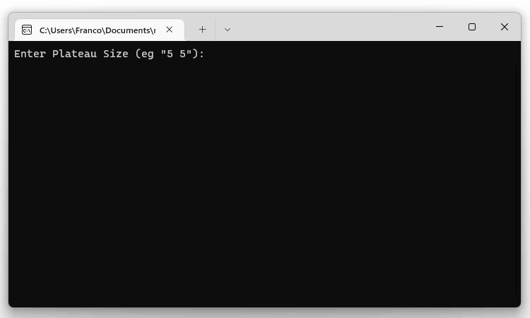

# Mars Rover Challenge

This repository contains a C# solution to the Mars Rover Challenge.



Here we have 3 folders:

1. The `MarsRover` folder contains the C# solution to the challenge
2. The `MarsRover.Tests` folder contains the unit tests for the solution
3. The `puml` folder contains the UML class diagram for the solution

## Instructions

To run the application, clone the repository to your computer.

Once cloned, you can run the application by navigating to `MarsRover` folder and run:

```
dotnet run
```
