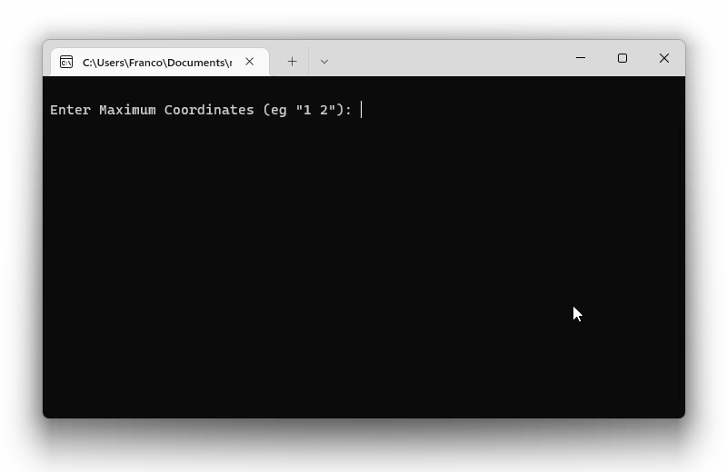

# Mars Rover Challenge

This repository contains a C# solution to the Mars Rover Challenge, where we're trying to create a program to represent Mars Rovers moving around a **Plateau** (a high ground surface with a well defined boundary)

Here we have 3 folders:

1. The `MarsRover` folder contains the C# solution to the challenge
2. The `MarsRover.Tests` folder contains the unit tests for the solution
3. The `diagrams` folder contains diagrams related to the solution

## Instructions

To run the application:

1. clone the repository to your computer
2. then navigate to the `MarsRover` folder (with `cd` command or otherwise)
3. then run the following command

```c#
dotnet run
```

## Demo



## Key Features

The program should allow users to:

1. create a **Plateau**
2. create **obstacles** on the Plateau
3. create **multiple Rovers** on the Plateau
4. move Rovers on the Plateau by sending **movement instruction**, such as "LMMRMMMRLMRMMLMR", to Rovers

After the user sent a **movement instruction** to a Rover, the program should print the final _position_ of the Rover after applying the movement instruction.

**Position** contains both **coordinates** and **direction**.

**Coordinates** contains 2 numbers, `x` and `y`, to represent the horizontal and vertical components.

## Assumptions

1. The **shape of the Plateau** is assumed to be **rectangular**, where the user can specify its `maximum coordinates` (Xmax, Ymax), so the rectangular plateau will have coordinates from (0, 0) to (Xmax, Ymax).
2. **Coordinates** consists of just 2 **integers**, for its "horizontal" and "vertical" components. Here we assume **integer**, as opposed to **float**, is sufficiently precise to represent our Rover's location on the Plateau.
3. **Direction** that our Rover faces can only be one of `North`, `East`, `South`, or `West`. Here we assume just having 4 directional values is sufficient for representating the rover's direction.
4. The **movement instruction** string consists of combination of "L", "R", and "M", to represent "Turn Left", "Turn Right", and "Move Forward" respectively. For example, an instruction of "MMRMML" represents "move forward 2 steps, turn right, move forward 2 steps, turn left".
5. Only one Rover is moving at a time.
6. When Rover follows a movement instruction that leads to an obstacle or plateau boundary, the Rover will sense the danger ahead and stop immediately before the danger, and not apply the proceeding instructions.

## Approaches

I started this project by drawing UML class diagram, to decide what components I'll need for this project.

The developmental process of this application can be visualised by 3 UML diagrams at each stages.

#### Early Stage


At the early stage, I read the challenge and decided it's crucial that "a vehicle can move on a plateau", so the UML diagram has the `Vehicle` class as the "main class" that interacts with other classes.

In particular, the `Vehicle` class has a private field that stores an `IPlateau`, so that the `Vehicle` class can access the `IPlateau`'s method to determine if the vehicle is about to move outside of the boundary of the plateau.

I also decided to use **interfaces** (`IPlateau`, `IInstructionReader`) and **abstract class** (`Vehicle`) for the class dependencies, so that the application would be loosely coupled, such that a user can in theory easily create classes that implements or inherits from the interfaces or abstract class to extend functionality.

The exception to the "loosely coupling" would be for the `Direction` Enum, `Coordinates` class, and `SingularInstruction` Enum, because I see them as "elemental" types that would be used by other classes much like how `int`, `string` gets used pretty much everywhere.

After drawing the "early stage" UML diagram, I started coding the classes and _tried_ doing TDD along the way. **Tried** is the keyword because I made the mistake of coding the `Rover` class first which depend on everything else.

So I ended up coding the whole UML and made many adjustments to the UML diagrams before I got to doing TDD.

#### Mid Stage


The "Mid Stage" UML diagram is the result of coding the "early stage" diagram and realising how the UML should look "in practice".

There's some "reasonable" changes made to the UML, such as changing `IPlateau` from an **interface** into an **abstract class** `PlateauBase`. The reason for the change is that interface cannot have fields, and I want the `PlateauBase` to have a field to store a list of obstacles, as well as methods that operate on the list of obstacles.

There's also some "questionable" changes, such as
changing the `Direction` **Enum** into a **class**. The reason for the change is that I wanted `Direction` a method that returns the (x,y) coordinates representation of the direction. Having such a method would make life easier because when the vehicle that's facing north needs to move forward, we can just do

```c#
vehicleCoordinates += direction.GetMovementVector()
```

assuming we've overloaded the `+` operator for `Coordinates` to do vector sum.

The drawback of turning `Direction` into a **class** is that it's reference type (so I need to be careful for equality comparison) and its storage for direction involves **string**. So any code that uses `Direction` would need to use the actual string, for example "north", when doing comparison.

There's a new class `CommandHandler` at the top of the UML diagram, for sending "move instructions" (such as "LMRMMM") to the vehicle.

After I reached the "Mid Stage" UML diagram, I decided to delete the whole C# code and start fresh to do TDD rigorously [[git commit]](https://github.com/iamfranco/MarsRoverChallenge/commit/b83730da4d4daf442d0f0f879acf1f61c59c899c).

This time I learned from my past mistake, so I started coding the lowest level of components, `Coordinates`, and work my way up to higher level components.

After that, I received some feedback from TechReturners coach and had multiple group sessions with my cohort about this challenge. The takeaways are:

1. I should consider using **Enum** for `Direction`, where the worst case scenario is I'll have other classes, such as `VehicleBase`, to handle each direction differently. Or I'll have a "directionHandler" for handling the 4 directions.
2. The solution should consider having multiple vehicles on the same plateau, where one vehicle could collide with another vehicle.
3. Most people have one big class (`CommandHandler`) that interact with the user interface, and are looking for ways to split the big class into smaller classes, for the "single responsibility principle". This makes me question if I have some classes that are doing too much and can be splitted into smaller classes.
4. Some people have a `MissionHandler` to control the interaction between **Vehicle** and **Plateau** (to see if vehicle is about to hit the boundary of plateau). This approach is intended to allow multiple vehicles on the same plateau. Hearing this makes me reconsider my approach of having a field inside `VehicleBase` that stores `PlateauBase`.

After the feedback and conversations, I've modified the UML and subsequently the code along with the unit tests. This brings us to the "Current Stage" UML diagram.

#### Current Stage


Things to note:

1. Introduced `Position` **struct** that consists of `Coordinates` and `Direction` (**struct** is value type, so it's easy for value comparison, and cannot be null I don't need to null check it)
2. `Direction` is now back to being an **Enum** with "extension methods" (methods that takes input of type `Direction` with the `this` keyword)
3. `PlateauBase` now has a `VehiclesContainer` which contains a list of `VehicleBase` instances, to represent the vehicles on the plateau. The `VehiclesContainer` also has methods that manipulates the list of `VehicleBase`
4. `PlateauBase` now has a `ObstaclesContainer` to handle the obstacles related operations previously within `PlateauBase`.

## Future thoughts

### Support for different types of vehicle

If the user wants to model a new type of vehicle, then they'll have to:

1. create a new class for the new vehicle type
2. make the new vehicle class implement from the `VehicleBase` abstract class
3.

### Support for different shapes of plateau

If the user wants to model different shapes of plateau other than rectangular, then they'll have to:

1. create a new class for the new plateau shape
2. make the new plateau class implement from the `PlateauBase` abstract class
3.

### Support for different movement instruction string format

Let's say the user wants to instruct the vehicle to "turn left" and then "move forward" for 100 times. Then in the standard instruction string formatting, it'll be "LMMMMMMMMMMM...M" with 100 M's, not the most convenient way to write it.

A better way to represent that might be to write "L M100" instead. But for the "LM100" to get read correctly by the
